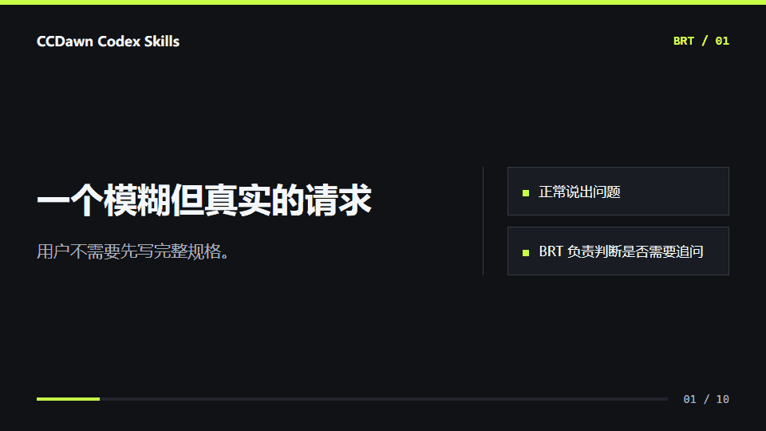

# CCDawn Codex Skills

[](https://github.com/CCDawn/codex-skills/releases)
[](https://github.com/CCDawn/codex-skills/actions/workflows/validate.yml)
[](LICENSE)
[](#skill-catalog)
[](https://agentskills.io/)
[](https://skills.sh/CCDawn/codex-skills)

**Let Codex understand what you mean before deciding how to work.**

CCDawn is a Chinese-first collection of 26 Agent Skills for intent alignment, dynamic routing, multi-thread coordination, lightweight development, development cleanup, code review, UI design, and AI research workflows.

- Users describe the task normally. They do not need to invoke `/brt` or memorize a workflow.
- [`ccdawn-brt`](skills/engineering/ccdawn-brt/SKILL.md) proceeds immediately when intent is clear and starts a focused discussion only when ambiguity could materially change the result.
- Simple work stays simple. Durable plans, embedded task graphs, and compact TDD appear only when the risk justifies them.

**English** | [简体中文](README.md)

## BRT in 20 Seconds



This is an illustrative workflow: the user describes the task normally; BRT inspects available context, discusses only decisions that change the result, and hands the aligned task to the most specific skill.

## Quick Start

Preview the main entry skill:

```bash
gh skill preview CCDawn/codex-skills ccdawn-brt
```

List or install the skills with the Agent Skills CLI:

```bash
npx skills add CCDawn/codex-skills --list
npx skills add CCDawn/codex-skills --skill '*' -g -a codex -y
```

For CCDawn's full installation policy, including dry-run, live-copy validation, and reversible conflict handling:

```powershell
git clone https://github.com/CCDawn/codex-skills.git
Set-Location codex-skills
powershell -ExecutionPolicy Bypass -File .\install.ps1
```

```bash
git clone https://github.com/CCDawn/codex-skills.git
cd codex-skills
sh ./install.sh
```

The repository installer targets `~/.codex/skills` by default and avoids installing a duplicate copy into `~/.agents/skills`.

## What Makes It Different

| Problem | CCDawn approach |
| --- | --- |
| The request is incomplete | Inspect available evidence, then discuss only decisions that change the result |
| Many skills exist but routing is manual | BRT selects the most specific owner and can combine multiple intents |
| Installed GitHub, browser, Figma, or artifact tools are ignored | BRT routes to currently available capabilities while CCDawn retains intent and acceptance ownership |
| Small changes trigger heavyweight process | Scale workflow weight per subtask and prefer direct implementation plus verification |
| Reviews stop after listing findings | Build a dependency-aware action queue and continue within the agreed boundary |
| Multiple Codex threads develop in one project | Share compact progress and coordinate scopes, discussion, pause/resume, and merge order |
| Finished features leave temporary files and stale branches | Clean only known attributable residue or resources covered by an explicit cleanup request |
| Research experiments get treated like software tests | Separate research, score loops, rigor review, and deterministic software TDD |

## Featured Skills

- [`ccdawn-brt`](skills/engineering/ccdawn-brt/SKILL.md): intent inference, collaborative alignment, routing, and workflow-weight control.
- [`ccdawn-thread-coordination`](skills/engineering/ccdawn-thread-coordination/SKILL.md): shared progress, conflict, discussion, pause/resume, and fast-merge coordination for same-project agents.
- [`ccdawn-development-cleanup`](skills/engineering/ccdawn-development-cleanup/SKILL.md): post-development residue and safe merged local branch, worktree, and claim cleanup.
- [`ccdawn-bug-review`](skills/engineering/ccdawn-bug-review/SKILL.md): evidence-driven diagnosis, bounded repair, and verification.
- [`ccdawn-pr-review`](skills/engineering/ccdawn-pr-review/SKILL.md): risk-ranked PR and diff review with merge-readiness evidence.
- [`ccdawn-ui-design`](skills/engineering/ccdawn-ui-design/SKILL.md): UI/UX direction, responsive behavior, accessibility, and browser visual QA.
- [`ccdawn-visual-design`](skills/engineering/ccdawn-visual-design/SKILL.md): context-aware brand expression, typography, color, composition, imagery, and motion direction.
- [`ccdawn-frontend-engineering`](skills/engineering/ccdawn-frontend-engineering/SKILL.md): production implementation of accepted UI contracts with runtime evidence.
- [`ccdawn-ui-review`](skills/engineering/ccdawn-ui-review/SKILL.md): findings-first review of existing interfaces using user tasks and browser evidence.
- [`ccdawn-design-system`](skills/engineering/ccdawn-design-system/SKILL.md): shared token, theme, component API, variant, and Figma-to-code governance.
- [`ccdawn-ai-research-loop`](skills/research/ccdawn-ai-research-loop/SKILL.md): baseline reproduction, hypotheses, experiments, ablations, and research synthesis.
- [`ccdawn-feature-reuse-research`](skills/engineering/ccdawn-feature-reuse-research/SKILL.md): reuse research for complex feature decisions.

## Skill Catalog

### Engineering

- [`ccdawn-brt`](skills/engineering/ccdawn-brt/SKILL.md)
- [`ccdawn-thread-coordination`](skills/engineering/ccdawn-thread-coordination/SKILL.md)
- [`ccdawn-development-cleanup`](skills/engineering/ccdawn-development-cleanup/SKILL.md)
- [`ccdawn-bug-review`](skills/engineering/ccdawn-bug-review/SKILL.md)
- [`ccdawn-pr-review`](skills/engineering/ccdawn-pr-review/SKILL.md)
- [`ccdawn-project-review`](skills/engineering/ccdawn-project-review/SKILL.md)
- [`ccdawn-ui-design`](skills/engineering/ccdawn-ui-design/SKILL.md)
- [`ccdawn-visual-design`](skills/engineering/ccdawn-visual-design/SKILL.md)
- [`ccdawn-frontend-engineering`](skills/engineering/ccdawn-frontend-engineering/SKILL.md)
- [`ccdawn-ui-review`](skills/engineering/ccdawn-ui-review/SKILL.md)
- [`ccdawn-design-system`](skills/engineering/ccdawn-design-system/SKILL.md)
- [`ccdawn-feature-reuse-research`](skills/engineering/ccdawn-feature-reuse-research/SKILL.md)
- [`ccdawn-planning`](skills/engineering/ccdawn-planning/SKILL.md)
- [`ccdawn-bdd-tdd-development`](skills/engineering/ccdawn-bdd-tdd-development/SKILL.md)
- [`ccdawn-completion-summary`](skills/engineering/ccdawn-completion-summary/SKILL.md)
- [`ccdawn-simplification-review`](skills/engineering/ccdawn-simplification-review/SKILL.md)
- [`ccdawn-simplification-audit`](skills/engineering/ccdawn-simplification-audit/SKILL.md)
- [`ccdawn-evaluation`](skills/engineering/ccdawn-evaluation/SKILL.md)
- [`ccdawn-goal-loop`](skills/engineering/ccdawn-goal-loop/SKILL.md)
- [`ccdawn-dawn-agent-html-memory`](skills/engineering/ccdawn-dawn-agent-html-memory/SKILL.md)

### AI Research and Competition

- [`ccdawn-ai-research-loop`](skills/research/ccdawn-ai-research-loop/SKILL.md)
- [`ccdawn-research-rigor-review`](skills/research/ccdawn-research-rigor-review/SKILL.md)
- [`ccdawn-competition-research-lifecycle`](skills/research/ccdawn-competition-research-lifecycle/SKILL.md)
- [`ccdawn-score-loop`](skills/competition/ccdawn-score-loop/SKILL.md)
- [`ccdawn-huawei-nslb-score-loop`](skills/competition/ccdawn-huawei-nslb-score-loop/SKILL.md)

### Creativity

- [`ccdawn-creative-toolbox`](skills/creative/ccdawn-creative-toolbox/SKILL.md)

## Contributing

See [CONTRIBUTING.md](CONTRIBUTING.md) for package rules and validation requirements. The repository is available under the [MIT License](LICENSE).
